# Architecture

How a Sona deployment fits together: one SvelteKit app on Cloudflare Pages,
two Cloudflare bindings (D1 and R2), and a set of optional external
integrations that turn on when their secrets or settings are present.

```mermaid
graph TB
    Visitor[🌐 Visitor]
    Operator[🔑 Operator]

    subgraph "Cloudflare Pages — Sona (SvelteKit)"
        Hooks[🛡️ hooks.server — CSP, setup gate, sessions]
        Public[🖼️ Public routes — galleries, characters, VR, stickers]
        Admin[🛠️ Admin routes — setup wizard, uploads, settings]
        TagCallers[🏷️ Tag suggestion callers — upload form, image edit form, /admin/images/suggest-tags backfill]
        API[⚙️ API routes — /api/*, /img, oEmbed, RSS feed, cron]
        QR[📱 /connect/qr — convention scan target, reads no D1]

        subgraph "Server lib"
            Auth[🔐 Admin auth + password reset]
            Storage[📦 Storage abstraction]
            Scrub[🧹 Metadata scrub — every write, fail closed]
            Importers[📥 Importers — Telegram stickers, FurTrack, fursuit]
            RegClient[🔄 Registry client — search, submit, sync]
            Gates[🎟️ Supporter keys + early access + NSFW gating]
            RateLimit[⏱️ Rate limiting + Turnstile verify]
        end
    end

    subgraph "Cloudflare bindings"
        D1[(💾 D1 — Drizzle)]
        R2[(🪣 R2 images bucket)]
        CDN[🚀 R2 public custom domain]
    end

    subgraph "Registry (registry.sona.fast)"
        RegWorker[⚙️ Registry Worker — daily cron]
        RegD1[(💾 Registry D1)]
    end

    subgraph "External services"
        TG[🤖 Telegram Bot API]
        FurTrack[📸 FurTrack]
        FuzzySearch[🔍 FuzzySearch — reverse image search]
        Resend[✉️ Resend]
        Turnstile[🧩 Cloudflare Turnstile]
        ConsFYI[📅 cons.fyi]
        Avatars[🖼️ Bluesky + X — profile pictures, tweet media]
        Entail[🏷️ entail.dev — image tag classifier]
        UT[☁️ UploadThing — optional]
        GoogleCSS2[🔤 Google CSS2 API — build time only]
    end

    subgraph "GitHub Actions"
        CI[✅ ci.yml — lint, typecheck, tests on push + PR]
        Deploy[🚀 deploy.yml — Pages deploy on push to main]
        CronWF[⏰ Scheduled workflows — sticker resync, artist sync, avatar refresh, orphan cleanup]
        Release[🏷️ release.yml — tagged v* releases]
    end

    subgraph "Theme build"
        ThemeData[🎨 src/lib/themes/*.theme.ts — theme data]
        ThemeBuild[🛠️ scripts/build-themes.ts — runs on prepare]
        ThemeCSS[📄 src/lib/themes/generated.css — committed, imported by src/app.css]
        FetchFonts[🔤 scripts/fetch-fonts.mjs — developer-run, not CI]
        FontFiles[📁 static/fonts/ — committed woff2 + manifest]
    end

    Forks[🌍 Forks — independent deployments, sync via releases]

    Visitor --> Hooks
    Operator --> Hooks
    Hooks --> Public
    Hooks --> Admin
    Hooks --> API
    Hooks --> QR

    Admin --> Auth
    Admin --> TagCallers
    TagCallers -->|POST /api/admin/tag-suggestions| API
    Admin --> Storage
    Admin --> Importers
    Importers --> Storage
    Admin --> RegClient
    Public --> Gates
    API --> RateLimit
    API --> Storage

    Auth --> D1
    Gates --> D1
    RegClient --> D1
    Importers --> D1
    Storage --> Scrub
    Scrub --> R2
    Scrub -.->|alternative provider| UT
    R2 --> CDN
    CDN --> Visitor
    UT -.->|serves its own file URLs| Visitor

    Importers -->|sticker sets| TG
    Importers -->|photo import| FurTrack
    Admin -->|artist lookup| FuzzySearch
    Auth -->|reset email| Resend
    RateLimit --> Turnstile
    Public -->|convention dates| ConsFYI
    API -->|tag suggestions for a source post| Entail

    RegClient -->|search / pull / submit| RegWorker
    RegWorker --> RegD1

    CI --> Deploy
    Deploy -->|wrangler pages deploy| Hooks
    CronWF -->|POST /api/cron/* with CRON_SECRET| API
    API -->|fetch profile pictures to re-host, resolve tweet media| Avatars
    Admin -->|fetch profile pictures to re-host| Avatars
    Release -.->|pull tagged releases| Forks

    ThemeData --> ThemeBuild
    ThemeBuild -->|renders| ThemeCSS
    GoogleCSS2 -->|woff2 slices + unicode-range| FetchFonts
    FetchFonts --> FontFiles
    FontFiles -->|every face src must exist| ThemeBuild
    FontFiles -->|/fonts/* same-origin at runtime| Visitor
    ThemeCSS -->|styles every page| Public
    ThemeCSS --> Admin
    CI -->|tracked, no drift, themes:check| ThemeCSS
```

## What the diagram asserts

- The app is one SvelteKit project deployed to Cloudflare Pages, with the two
  bindings declared in `wrangler.toml`: D1 (`DB`, accessed through Drizzle)
  and R2 (`IMAGES`).
- R2 is only active when the `storageProvider` site setting is `r2`;
  UploadThing is the alternative provider, so that edge is dotted.
- Every write reaches a provider through the metadata scrub
  (`src/lib/server/storage/scrub.ts`): the bytes are sniffed, and a raster
  image has its Exif, XMP and text metadata rewritten in place before it is
  stored. An image the scrub cannot walk is refused rather than stored, and
  `/api/upload` reports that as a 422. See `docs/image-metadata.md`.
- When R2 is the provider, image delivery to visitors goes through the
  bucket's public custom domain (the `r2PublicUrl` site setting), not through
  the app. With UploadThing selected, visitors load images from the URLs
  UploadThing returns at upload time.
- The artist registry is a separate Worker with its own D1 database and a
  daily cron trigger. The app talks to it over HTTP with `REGISTRY_API_KEY`;
  without the key, registry features stay off.
- `/connect/qr` is the one route that reads nothing from D1. It renders the
  fullscreen QR an operator holds up at a convention, so it sits outside both
  the admin session (which validates against D1 per request and fails closed)
  and the public layout that loads settings. Its payload comes from the request
  URL and the site name the root layout already carries. That is why a
  convention-wifi outage costs the admin panel but not the handoff.
- The cons.fyi feed supplies each convention's IANA timezone as well as its
  dates, which is what lets `/connect` decide "here now" in the event's own
  zone rather than the reader's or UTC.
- Telegram, FurTrack, FuzzySearch, Resend, and Turnstile are optional
  integrations, keyed off secrets or settings (see `wrangler.toml.example` for the full list).
- entail.dev needs no key or secret. The app calls it only when an operator
  asks for tag suggestions on an image whose source post is on Bluesky or X,
  and never on a render path or a schedule. Three admin surfaces ask: the
  upload form, the image edit form, and the `/admin/images/suggest-tags`
  backfill list, which works through the images that already carry such a post
  and have no tags yet. All three go through `POST
  /api/admin/tag-suggestions`. An X post takes one extra hop:
  X's own API resolves the post to its image, and that image URL is what
  entail.dev classifies.
- GitHub Actions is part of the runtime, not just delivery: the scheduled
  workflows (`sticker-resync` daily 06:00 UTC, `artist-sync` 06:30,
  `avatar-refresh` 07:00, `cleanup-orphans` weekly, `backfill-animated`
  dispatch-only) call the app's `POST /api/cron/*` endpoints with
  `CRON_SECRET` as the bearer. `avatar-refresh` calls on every fork rather than
  only opted-in ones, because it does two jobs: refreshing artists' avatars,
  which is opt-in through the `AVATAR_REFRESH_BATCH` repo variable, and
  re-hosting the site's own avatar when an earlier copy failed and left it on a
  third-party host, which nothing else retries. An unset dial sends `batch=0`,
  meaning the second job only. A fork with no `CRON_SECRET` warns and skips, as
  the other cron workflows do. That daily fork-wide run is also why the diagram
  now carries a profile-picture edge to Bluesky and X: re-hosting has always
  contacted them from an operator's save, but this makes it a scheduled
  dependency rather than an occasional one. Every push to `main` runs `ci.yml` and
  `deploy.yml`, which redeploys the Pages project; `deploy.yml` also has a
  manual dispatch for forks synced through GitHub's Sync fork button, which
  emits no push event.
- Themes are data. Each theme lives in `src/lib/themes/*.theme.ts`, and
  `scripts/build-themes.ts` renders them into `src/lib/themes/generated.css`,
  which `src/app.css` imports. The renderer runs from `prepare`, so `npm ci`
  regenerates the file. That file is committed, and `ci.yml` guards it three
  ways: `git ls-files --error-unmatch` proves it is still tracked, `git diff
  --exit-code` after the install catches a palette edit that was never
  regenerated, and `npm run themes:check` runs the renderer with its exit code
  exposed, because `prepare` swallows failures. The renderer also emits the
  `@font-face` blocks for the self-hosted typefaces in `static/fonts/`, so no
  page load reaches a font CDN and the CSP names no external stylesheet or font
  origin. `static/fonts/` is an input to the renderer as well as an output of the
  font script: a face whose `src` has no file behind it fails the build rather
  than rendering as CSS the browser silently falls back from.
- The font script is developer-run, not part of CI or the deploy. `node
  scripts/fetch-fonts.mjs` asks Google's CSS2 API for the Latin woff2 slices. It
  writes into `static/fonts/` and records a sha256 per file in `manifest.json`,
  and the woff2 files are committed, so a normal build and every fork deploy
  never run it. At runtime the browser fetches `/fonts/*` from the site's own
  origin — see `static/fonts/README.md`.
- Forks are independent deployments of the same stack on their owners' own
  Cloudflare accounts. They adopt changes by pulling the tagged releases that
  `release.yml` publishes — see `UPDATING.md` — not by tracking `main`.
