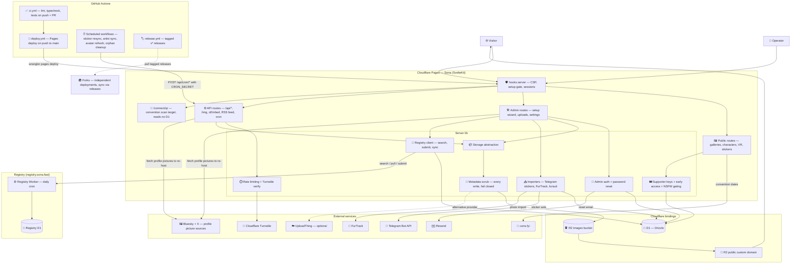

# Architecture

How a Sona deployment fits together: one SvelteKit app on Cloudflare Pages,
two Cloudflare bindings (D1 and R2), and a set of optional external
integrations that turn on when their secrets or settings are present.

## What the diagram asserts

- The app is one SvelteKit project deployed to Cloudflare Pages, with the two
  bindings declared in `wrangler.toml`: D1 (`DB`, accessed through Drizzle)
  and R2 (`IMAGES`).
- R2 is only active when the `storageProvider` site setting is `r2`;
  UploadThing is the alternative provider, so that edge is dotted.
- Every write reaches a provider through the metadata scrub
  (`src/lib/server/storage/scrub.ts`): the bytes are sniffed, and a raster
  image has its Exif, XMP and text metadata rewritten in place before it is
  stored. An image the scrub cannot walk is refused rather than stored, and
  `/api/upload` reports that as a 422. See `docs/image-metadata.md`.
- Image delivery to visitors goes through the R2 bucket's public custom
  domain (the `r2PublicUrl` site setting), not through the app.
- The artist registry is a separate Worker with its own D1 database and a
  daily cron trigger. The app talks to it over HTTP with `REGISTRY_API_KEY`;
  without the key, registry features stay off.
- `/connect/qr` is the one route that reads nothing from D1. It renders the
  fullscreen QR an operator holds up at a convention, so it sits outside both
  the admin session (which validates against D1 per request and fails closed)
  and the public layout that loads settings. Its payload comes from the request
  URL and the site name the root layout already carries. That is why a
  convention-wifi outage costs the admin panel but not the handoff.
- The cons.fyi feed supplies each convention's IANA timezone as well as its
  dates, which is what lets `/connect` decide "here now" in the event's own
  zone rather than the reader's or UTC.
- Telegram, FurTrack, Resend, and Turnstile are optional integrations, keyed
  off secrets or settings (see `wrangler.toml.example` for the full list).
- GitHub Actions is part of the runtime, not just delivery: the scheduled
  workflows (`sticker-resync` daily 06:00 UTC, `artist-sync` 06:30,
  `avatar-refresh` 07:00, `cleanup-orphans` weekly, `backfill-animated`
  dispatch-only) call the app's `POST /api/cron/*` endpoints with
  `CRON_SECRET` as the bearer. `avatar-refresh` calls on every fork rather than
  only opted-in ones, because it does two jobs: refreshing artists' avatars,
  which is opt-in through the `AVATAR_REFRESH_BATCH` repo variable, and
  re-hosting the site's own avatar when an earlier copy failed and left it on a
  third-party host, which nothing else retries. An unset dial sends `batch=0`,
  meaning the second job only. A fork with no `CRON_SECRET` warns and skips, as
  the other cron workflows do. That daily fork-wide run is also why the diagram
  now carries a profile-picture edge to Bluesky and X: re-hosting has always
  contacted them from an operator's save, but this makes it a scheduled
  dependency rather than an occasional one. Every push to `main` runs `ci.yml` and
  `deploy.yml`, which redeploys the Pages project; `deploy.yml` also has a
  manual dispatch for forks synced through GitHub's Sync fork button, which
  emits no push event.
- Forks are independent deployments of the same stack on their owners' own
  Cloudflare accounts. They adopt changes by pulling the tagged releases that
  `release.yml` publishes — see `UPDATING.md` — not by tracking `main`.
