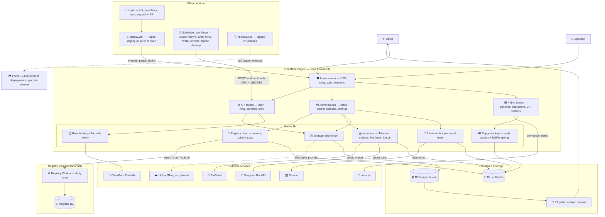

# Architecture

How a Sona deployment fits together: one SvelteKit app on Cloudflare Pages,
two Cloudflare bindings (D1 and R2), and a set of optional external
integrations that turn on when their secrets or settings are present.

## What the diagram asserts

- The app is one SvelteKit project deployed to Cloudflare Pages, with the two
  bindings declared in `wrangler.toml`: D1 (`DB`, accessed through Drizzle)
  and R2 (`IMAGES`).
- R2 is only active when the `storageProvider` site setting is `r2`;
  UploadThing is the alternative provider, so that edge is dotted.
- Image delivery to visitors goes through the R2 bucket's public custom
  domain (the `r2PublicUrl` site setting), not through the app.
- The artist registry is a separate Worker with its own D1 database and a
  daily cron trigger. The app talks to it over HTTP with `REGISTRY_API_KEY`;
  without the key, registry features stay off.
- Telegram, FurTrack, Resend, and Turnstile are optional integrations, keyed
  off secrets or settings (see `wrangler.toml.example` for the full list).
- GitHub Actions is part of the runtime, not just delivery: the scheduled
  workflows (`sticker-resync` daily 06:00 UTC, `artist-sync` 06:30,
  `avatar-refresh` 07:00, `cleanup-orphans` weekly, `backfill-animated`
  dispatch-only) call the app's `POST /api/cron/*` endpoints with
  `CRON_SECRET` as the bearer. Every push to `main` runs `ci.yml` and
  `deploy.yml`, which redeploys the Pages project; `deploy.yml` also has a
  manual dispatch for forks synced through GitHub's Sync fork button, which
  emits no push event.
- Forks are independent deployments of the same stack on their owners' own
  Cloudflare accounts. They adopt changes by pulling the tagged releases that
  `release.yml` publishes — see `UPDATING.md` — not by tracking `main`.
